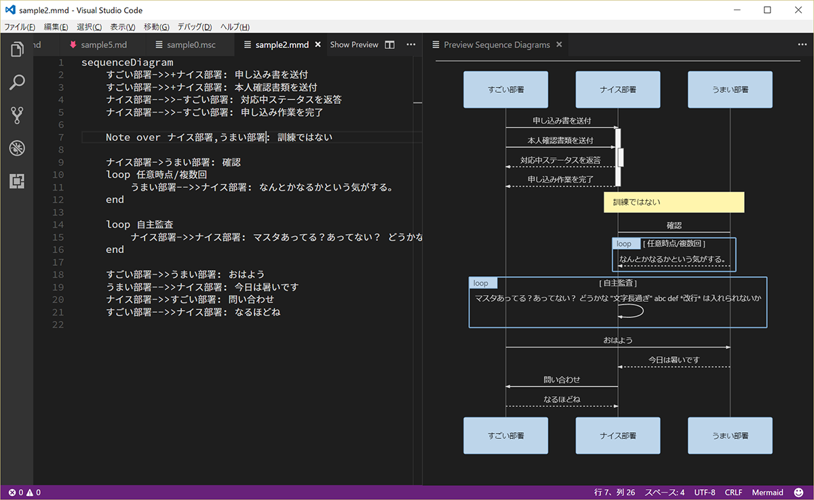

# Preview Sequence Diagrams (previewseqdiag-vscode) README

Preview Sequence Diagrams is an extension for vscode specialized for the preview function of mscgen and mermaid.



## Features

* Support mscgen format by mscgen_js.
* Support mermaid format.

## Requirements

### Dependencies

* npm rx
* npm mscgenjs / mscgenjs-inpage
* npm mermaid
* vscode extention mscgenjs.vscode-mscgen

## Extension Settings

This extension contributes the following settings:

* `previewSeqDiag.mscgen.fixedNamedStyle`: Setting to force usage for Mscgen, MsGenny, xu's preview's rendering style.
  * Set `lazy`, `classic`, `cygne`, `pegasse`, `fountainpen` or `null` (= cygne). (see [Name Style](https://mscgen.js.org/embed.html#named-styles))
* `previewSeqDiag.mermaid.fixedStyle`: Setting to force usage for Mermaid's preview's rendering style. 
  * Set `dark`, `forest`, `""` or `null` (= Switch according to the theme of VSCode)
* `previewSeqDiag.mermaid.fixedBackgroundColor`: Setting to force usage for Mermaid's preview's  background colo. 
  * Set `#rrggbb` e.g. #ffffff, `transparent` or `null` (= Depends on VSCode's Theme)

e.g.
```
    "previewSeqDiag.mscgen.fixedNamedStyle": "pegasse",
    "previewSeqDiag.mermaid.fixedStyle":"forest",
    "previewSeqDiag.mermaid.fixedBackgroundColor":"#ffffff",
```

## Known Issues

* In the current release, I only consider the Windows platform and develop it.　So, There should be something wrong.

## Release Notes

### 0.0.1

Initial **alpha** release.


----

## Appndeix

### Great thanks to

* [searKing/preview-vscode](https://github.com/searKing/preview-vscode)

### mscgen
* [Mscgen](http://www.mcternan.me.uk/mscgen/)
* [mscgen_js](https://mscgen.js.org/)

### mermaid
* [knsv/mermaid](https://github.com/knsv/mermaid)
* [mermaid docs](https://knsv.github.io/mermaid/)


