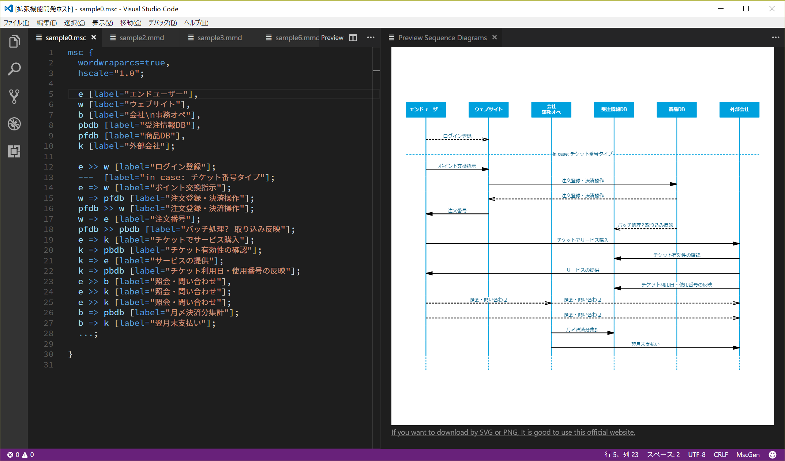

# Preview Sequence Diagrams

## README

Preview Sequence Diagrams (previewseqdiag-vscode) is an extension for vscode specialized for the preview function of mscgen and mermaid.


## Features

* Support to preview of Mermaid format.
* Support to preview of MscGen, MsGenny format.

## Special feature

* In you `.mmd` file, you can this following to import an other file inside:
```
%% import: my-file.md
```
This is usefull to avoid multipicate the same code on many files.

## Release Notes

[CHANGELOG.md](CHANGELOG.md)

### 0.1.0

* Support mermaid previewing on Mac.
  * In order to implement this function, I disabled the function of automatically selecting styles according to theme.
* Fixed configuration intellisense problem
* Change configuration format. (Backward compatible) see -> [Settings](#settings)
* Refactoring.

### 0.0.1

* Initial release.

## Known Issues

* SVG or PNG downloading is not supported. If you want to download by SVG or PNG, It is good to use lang's official websites. see, [Appendix](#appendix)
* In the preview of Mermaid's Dark and Neutral style, some displays become black.


## Requirements

## Settings

This extension contributes the following User Settings:

* `previewSeqDiag.mermaid.fixedStyle`: Setting to force usage for Mermaid's preview's rendering style.
  * Set `dark`, `forest` or `neutral` (default is `forest`, is force recommended. The dark or neutral theme of Mermaid 7.0.3 does incomplete rendering.)
* `previewSeqDiag.mermaid.fixedBackgroundColor`: Setting to force usage for Mermaid's preview's  background colo.
  * Set `#rrggbb` e.g. #ffffff, `transparent` (default is `#fafaf6`)

* `previewSeqDiag.mscgen.fixedNamedStyle`: Setting to force usage for Mscgen, MsGenny, xu's preview's rendering style.
  * Set `lazy`, `classic`, `cygne`, `pegasse`or `fountainpen` (default is `cygne`). (see [Name Style](https://mscgen.js.org/embed.html#named-styles))
* `previewSeqDiag.mscgen.horizontalAlignment`: Setting to force usage for Mscgen's rendering style. Indicates where an element should be displayed on the horizontal axis relative to the allocated layout slot of the peview window.
  * Set `fixed`or `stretch`(default is `stretch`)

e.g.  add to User Settings,

```
  "previewSeqDiag": {
    "mermaid": {
      "fixedBackgroundColor": "#f6f6ff",
      "fixedStyle": "dark"
    },
    "mscgen": {
      "fixedNamedStyle": "fountainpen",
      "horizontalAlignment": "fixed"
    }
  }
```

result is.


### Dependencies

* npm rx ^4.1.0
* npm mermaid ^7.0.3
* npm mscgenjs ^1.12.1 / mscgenjs-inpage ^1.12.1
* vscode extention mscgenjs.vscode-mscgen

----

## Appendix

### Great thanks to

* [searKing/preview-vscode](https://github.com/searKing/preview-vscode)

### mermaid
* [knsv/mermaid](https://github.com/knsv/mermaid)
* [mermaid docs](https://knsv.github.io/mermaid/)
* [mermaid live editor](https://knsv.github.io/mermaid/live_editor/) you can download by SVG.

### mscgen
* [Mscgen](http://www.mcternan.me.uk/mscgen/)
* [mscgen_js](https://mscgen.js.org/) you can download by SVG or PNG.

### samples

MscGen, msc, cygne, with dark theme.


Mermaid, graph.


Mermaid, gantt.

